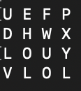
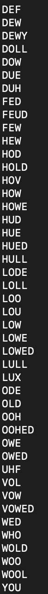

# Boggler
Generate a 4x4 board of letters, then like the game Boggle, find all English words within sequences of adjacent letters.

Example Generated Board:


Words Found for Generated Board:



## Run 

Requires PyEnchant, which contains the English dictionary used to determine words: https://pyenchant.github.io/pyenchant/install.html

Once PyEnchant is installed, simply run the script without arguments

```python3 boggler.py```
